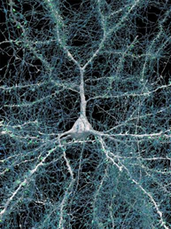
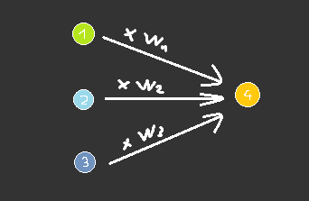
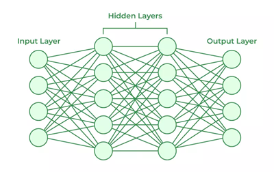
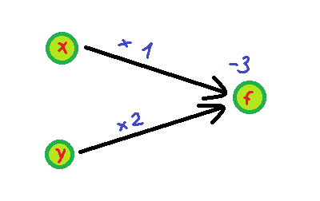
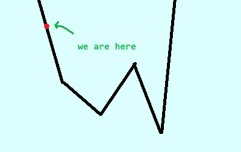
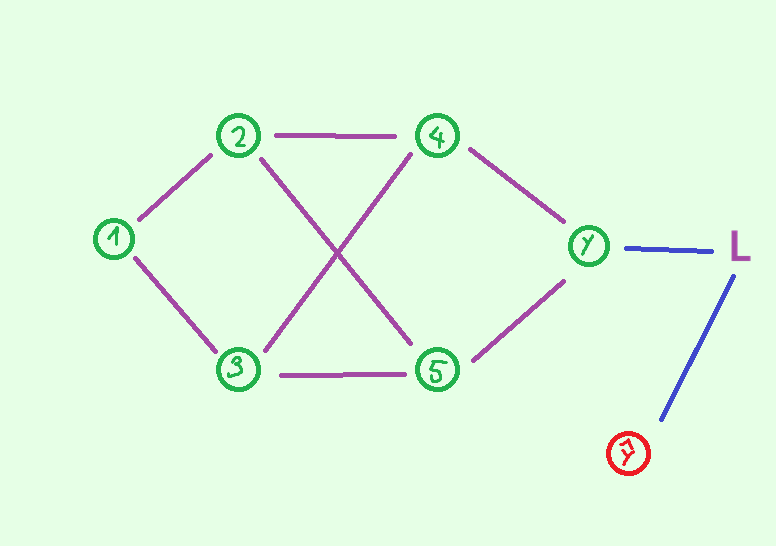

# How did I make LKTorch

## 0. Opening

I have spent more time than I would like to admit on this project, and implemented less features than I would desire. Nevertheless, I'm proud of this, and I have a lot to talk about in the making of this thing.

Now, this is less of a tutorial, where I seem to get everything correctly first try, and more like a diary, where I make bad design decision, fumble around, fix things up, and figure out many things along the way. 

I enjoy the making of this project very much, and I hope you can feel the same joy as I did, and this hopefully would inspire you to embark on your "build stuff from scratch" journey too!

## 1. Neural network for Machine Learning

So, like everyone who learn about Machine Learning, I saw this 3B1B video.

And I think it's very interesting how neural network works. You are essentially remodeling how the brain work inside the computer, using similar concepts in neurology such as neuron and perceptron.

And I thought to myself: Why not figuring out all the math from scratch?

### 1.1 The goal

Many problems are way too hard or tedious to solve and implement directly. For instance, classifying whether the image contains a chicken or a cow. There are way too many edge cases. 

Thus, we have the brilliant idea of coming up with a structure that can learn patterns from past data, and hopes it can perform well on information it has never seen before.

And that is the goal of Machine Learning. We are building a brain to learn specific things, or in other words, a function that we have no idea what is inside, but we know it's pretty good at transforming our input into the correct output, and can improve at doing that.

### 1.2 Perceptron

Our brains consists of computing units called neuron. We have a lot of them, and they are very efficient, therefore we are smart (most humans are dumb but you get the point).

*Figure 1: Unspeakable Eldritch horror that is human neuron*

We also have the equivalent of neuron for computers, called perceptron. Let's say we are building a brain that can classify whether the creature shown in the image is a cow or a chicken.

In the brain, each perceptron stands for a concept, and how confident is the perceptron about that concept. For example, `beak_perceptron = 0` could mean that it is confident that the creature shown on the image doesn't have a beak, `beak_perceptron = 0.67` could mean that it sees a beak, but there is still doubt. It's yellow, it's sharp, but we are not sure, we are only 67% sure.

What makes our brain powerful is the communication between different units of the brain, so let's do that. When classifying between cow and chicken, we would look for features like: how big is it, does it have two legs or four legs, does it have a beak, etc. These features could influence our final verdict, so it's helpful to consider all of them.

Our first instinct is to set the value of our output perceptron as the sum of all of the relevant perceptron that comes before it. 

$$
U_{output} = \sum_{i \in input} U_i
$$

However, there are features more important than another. This is why we should also set for each of them a scaling factor, standing for how relevant each input perceptron to our output perceptron.

$$
U_{output} = \sum_{i \in input} U_i \times W_i
$$
- *$W_i$ stands for the scaling factor for each input perceptron. It is a parameter we have to set.*

*Figure 2: Perceptron that takes in the value of the previous perceptrons.*

But, sometimes we want our output perceptron to be very strict, and only becomes confident when every perceptron before it is confident. And sometimes we want it to be easily activated, where a slight bit of confidence in the perceptron before it will lead to it being confident. therefore we introduce a bias factor.

$$
U_{output} = B_{output} + \sum_{i \in input} U_i \times W_i 
$$

- *$W_i$ stands for the scaling factor for each input perceptron. It is a parameter we have to set.*
- *$B_{output}$ stands for the bias factor of the output perceptron. It is a parameter we have to set.*

### 1.3 Neural Network

So, we have the definition of a perceptron, and how to calculate its confidence based on the previous perceptrons. For example, let's look at the image shown. Our beak perceptron is confident that it has a beak, and our leg perceptron is confident that it has less than four leg, therefore it is definitely a chicken.

*Figure 3: A chicken.*

But wait, how do we detect that the creature in the image also has a beak? That problem is nearly just as hard! Therefore, we have to create another perceptron that recognize any sharp and yellow object on the creature's head, then another perceptron for the lines and curves and colors, etc. 

Basically, if the concept that our perceptron stands for is too abstract, we can just add more perceptrons that is  another layer of abstraction below it. 

You can think of a robot brain as layers upon layers of abstraction, from the raw pixel of an image, to the lines and curves, to a beak, to the concept of a chicken. 

And we can actually model this in the computer too! That is called a neural network.

*Figure 4: A neural network.*

In the neural network, we have multiple layers of perceptron. Each layer of perceptron stands for a layer of abstraction, and each of the layer is fully connected to the previous layer, which means that the features of each layer of abstraction is influenced by a combination of the less abstract features that comes before it.

So now, you can make a neural network by hand, and tune the parameter accordingly to mimic a function. For instance, if you want to simulate the function $f(x, y) = x + 2y - 3$ in the neural network, you can just do this:

*Figure 5: A neural network that stands for $f(x, y) = x + 2y - 3$.*

### 1.4 Linearity problems

If you have a keen eye, you can notice that every perceptron in the output layer is just a linear combinations of perceptrons in the input layer, therefore our neural network actually sucks, because we can't model non-linear function!

*Or can we?*

We can't model non-linear function because everything in our neural network is linear. To fix it, we just have to put a non-linear function in the calculation of the perceptrons. Our new perceptrons layer is now like this.

$$
U_{output} = f\left(B_{output} + \sum_{i \in input} U_i \times W_i\right)
$$

- *$W_i$ stands for the scaling factor for each input perceptron. It is a parameter we have to set.*
- *$B_{output}$ stands for the bias factor of the output perceptron. It is a parameter we have to set.*
- *$f$ stands for the non-linear function of our choice.*

The non-linear function is formally called **activation function**. Some of the common activation functions are:

$$
reLU(x) = \begin{cases} x, & x \geq 0 \\ 0, & x < 0 \end{cases} \\
\sigma(x) = \frac{1}{1 + e^{-x}} \\
tanh(x) = \frac{e^x - e^{-x}}{e^x + e^{-x}}
$$

Now, if we set the parameters $W_i$ and $B_i$ correctly, and the structure of the neural network is complex enough, we can mimic any function!

*Right?*

### 1.5 Universal Approximation Theorem

Citing [Wikipedia - Universal Approximation Theorem](https://en.wikipedia.org/wiki/Universal_approximation_theorem):

*"In the field of machine learning, the universal approximation theorems (UATs) state that neural networks with a certain structure can, in principle, approximate any continuous function to any desired degree of accuracy."*

This means if we are given a continuous function, there exist a neural network that can mimic it. And continuous function is a wide term, ranging from simple computational functions, to facial recognition, data analysis, and even ChatGPT!

Of course, this only say about the existence of a neural network that can mimic our desired function, not how do we come up with the structure of our neural network or how to train it. But, now we know that this structure works, as long as you try hard enough.

### 1.6 Intuition on neural network structure

Many lifetimes have been dedicated to researching and figuring out what is the best activation function to use in a neural network, the optimal architecture of the ML model for each class of problems, etc.

However, based on the introduction of the neural network (read [1.2](#12-perceptron) and [1.3](#13-neural-network)) there are some simple intuitions that you could use to determine the depth and the width of the neural network:

- More depth = More layers of abstraction.
- More width = More features in each layer of abstraction.
- Too much depth = Unpredictable result.
- Too little depth = Too predictable result.

For instance, according to [UAT](#15-universal-approximation-theorem), a neural network with a single layer in between the input and outupt layer is enough to learn any function. However, in this case, it would be similar to a look-up table. Remember, the reason why neural network is powerful for Machine Learning is because we can model a problem into layers of abstraction.

### 1.7 Training the network

So we know the definition of a neural network, its use for machine learning, but we don't really know how to set the parameters for any practical use at all. For instance, a neural network with 67 parameters can be think of as the function: 

$$
f(p_1, p_2, ..., p_{67}, x) = y
$$

- *Where $x$ is our input data and $y$ is the neural network output data.*

If we were to set the weights and biases randomly, the neural network would spits out absolute bullcrap. And to say setting the parameters by hands tedious is an understatement. 

Luckily, we don't have to set the parameters ourselves. We can train it. And this would be the last and the meatiest part of this whole section.

#### 1.7.1 Loss Function

We need a loss function to punish the neural network if it's wrong. Our choice is MSE (Mean Squared Error)

$$
L = \frac{1}{N} \sum_{i = 1}^{N} (y_i - \hat{y_i}) ^ 2
$$

For example, if the neural network output $(1, 1)$, and the actual result is $(0, 0)$, we got $L = 1$, and this tells us that the prediction of the network is really far off.

Now, our job simplifies to minimizing a single loss value.

$$
L(p_1, p_2, ..., p_{67}, x, \hat{y}) = \frac{1}{N} \sum_{i = 1}^{N} (y_i - \hat{y_i}) ^ 2
$$

 This means we get to bring our optimization knowledge into the game!

#### 1.7.2 Gradient descent

The aforementioned 67 parameters function is too complex to think about, so let's solve it for 1 parameters first. Our job is to minimize $L(p)$

*Figure 6: $L(p)$ graphed. Our job is to choose $p$ such that $L(p)$ is minimized.*

One good way to optimize $L(p)$ is to calculate $L'(p)$, which in this case is negative, and it tells us that we should increase $p$ to decrease $L(p)$. The larger the absolute value $L'(p)$ is, the further we need to step.

However, do note that this algorithm will only let our neural network arrive at a local minimum, not a global one. Finding a global minimum is impossible anyway, we will take what we can get. A local minimum is still better than no minimum.

Prerequisite knowledge: gradient

Gradient ($\nabla$) is just the multivariable calculus variant of derivative. It means: the derivative of every variable with respect to the function.

For instance, $f(x, y) = x^2 + y^3$.

We have $\nabla f = \left(\frac{\partial f}{\partial x}, \frac{\partial f}{\partial y}\right) = (2x, 3y^2)$.

For a multivariable function, we also do the same. We will calculate $\nabla L$. Then, we change each parameters according to the partial derivative of that parameter with respect to $L$.

This technique is called **Gradient Descent**. 

#### 1.7.3 Calculate the gradient

Prerequisite knowledge: multivariable chain rule

If we have a function $f(x_1, x_2, ..., x_n)$, and we have another variable $u$ that $x_1, x_2, ..., x_n$ depends on, then we have:

$$
\frac{\partial f}{\partial u} = \sum_{i = 1}^{n} \frac{\partial f}{\partial x_i} \frac{\partial x_i}{\partial u} 
$$

Let's take a look at this neural network:

*Figure 7: Our example neural network for the gradient calculation example.*

Some notations to make things easier:
- $x_i$ means the value at the $i^{th}$ perceptron.
- $w_{i,j}$ means the weight from the $i^{th}$ to the $j^{th}$ perceptron.
- $b_i$ means the bias of the $i^{th}$ perceptron.
- $O(i)$ is the set of every nodes that $i$ has a directed edge to.
- $I(i)$ is the set of every nodes that has a directed edge to $i$.

We have:

$$
\frac{\partial L}{\partial x_y} = 2(x_y - x_{\hat{y}})
$$

$$
\frac{\partial L}{\partial x_i} = \sum_{j \in O(i)}\frac{\partial L}{\partial x_j} \frac{\partial x_j}{\partial x_i} = \sum_{j \in O(i)}\frac{\partial L}{\partial x_j} w_{i, j}
$$

$$
\frac{\partial L}{\partial w_{i, j}} = \frac{\partial L}{\partial x_j} \frac{\partial x_j}{\partial w_{i, j}} = \frac{\partial L}{\partial x_j} x_i
$$

$$
\frac{\partial L}{\partial b_i} = \frac{\partial L}{\partial x_i} \frac{\partial x_i}{\partial b_i} = \frac{\partial L}{\partial x_i}
$$

This means we can calculate the partial derivative of every perceptron $\frac{\partial L}{\partial x_i}$ based on the partial derivative of every node after it. And we can calculate the partial derivative of every parameter $w_{i, j}$ and $b_j$ based on $\frac{\partial L}{\partial x_j}$.

We now have a simple gradient calculation algorithm: 

- We topologically sort all of the perceptrons in the network, then go backward to calculate the value of their partial derivative. (This is known as the backward pass).

- From the partial derivative of the nodes, we can calculate the partial derivative of the parameters, thus we obtained the gradient of the entire network.

So we have our first trainable neural network implementation!

#### 1.7.4 Linear Algebra!!!

Graph algorithm are notoriously slow, because we have the overhead of looping through the edge list constantly. This is why our implementation will take an eternity to run and is impossible to optimize. Let's make the graph smaller!

Let's call:

- The values of nodes in the $i^{th}$ layer $X_i$/
- The bias of the node in the $i^{th}$ layer $B_i$.
- The weight between the $u^{th}$ node of the $i^{th}$ layer and the $v^{th}$ node of the $(i+1)^{th}$ layer as $W_{i, u, v}$

Let's recall that:
$$
X_{i+1, v} = f\left(B_{i+1, v} + \sum X_{i, u} \times W_{u, v}\right)
$$

We can see that the transformation from the $i^{th}$ layer to the $(i+1)^{th}$ layer is essentially a matrix multiplication and a matrix addition. So we can rewrite it as:

$$
X_{i+1} = f\left(B_{i+1} + X_i \times W_i\right)
$$

So instead of treating each perceptron as a node in the graph, we can treat the entire layer as a node. Instead of treating each weight parameter as an edge in the graph, we can treat the entire weight matrix as an edge. Which means that our graph now has less nodes, less edge, and we get to use matrix multiplication (which are optimized to death).

But what about the backward phase? Let's take a look at the formula again:

$$
\frac{\partial L}{\partial X_{i, u}} = \sum \frac{\partial L}{\partial X_{i+1, v}} \frac{\partial X_{i+1, v}}{\partial X_{i, u}} = \sum \frac{\partial L}{\partial X_{i+1, v}} W_{i, u, v}
$$

$$
\frac{\partial L}{\partial W_{i, u, v}} = \frac{\partial L}{\partial X_{i+1, v}} \frac{\partial X_{i+1, v}}{\partial W_{i, u, v}} = \frac{\partial L}{\partial X_{i+1, v}} X_{i, u}
$$

$$
\frac{\partial L}{\partial B_{i, u}} = \frac{\partial L}{\partial X_{i, u}} \frac{\partial X_{i, u}}{\partial B_{i, u}} = \frac{\partial L}{\partial X_{i, u}}
$$

We can rewrite this as:

$$
\frac{\partial L}{\partial X_i} = \frac{\partial L}{\partial X_{i+1}} \frac{\partial X_{i+1}}{\partial X_i} = \frac{\partial L}{\partial X_{i+1}} W_i^T
$$

$$
\frac{\partial L}{\partial W_i} = \frac{\partial L}{\partial X_{i+1}} \frac{\partial X_{i+1}}{\partial W_i} = \frac{\partial L}{\partial X_{i+1}} X_i^T
$$

$$
\frac{\partial L}{\partial B_i} = \frac{\partial L}{\partial X_i} \frac{\partial X_i}{\partial B_i} = \frac{\partial L}{\partial X_i}
$$

So we rewrote the entire neural network in linear algebra math! Awesome! That means our algorithm would be super fast, as long as we are not reinventing the wheel and use matrix multiplication libraries like a good boy (I am not).

*This is a simplification because we haven't taken into account the activation function yet. But, it is a trivial extension, as you only need to treat it as another separate layer, so I will leave that as an exercise for the reader.*

## 2. Tensor math, and how that generalized the neural network math even more

WIP

## 3. The library implementation

WIP

## 4. Convert it into python

WIP